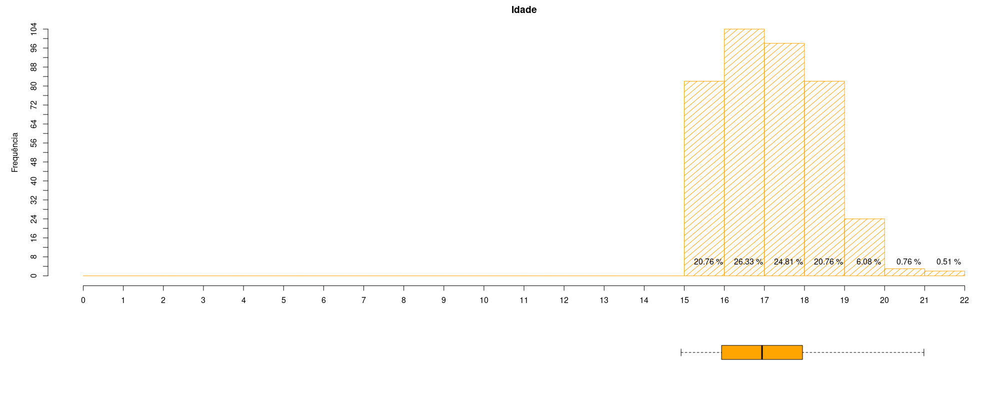
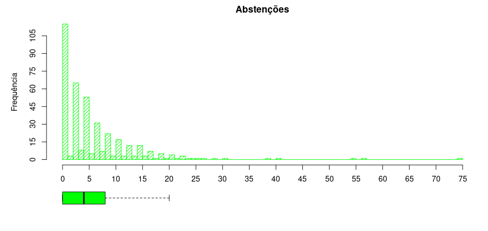

# summary-measures-two-dimensional-analysis
O arquivo mat_estudantes.csv contém dados referentes ao desempenho de alunos na disciplina de Matemática, no ensino médio de duas escolas. Os atributos dos dados incluem notas dos alunos, características demográficas, sociais e escolares, e foram coletados por meio de relatórios e questionários.  Fonte: Paulo Cortez.

## Frequência relativa da variável Idades

## Frequência relativa da variável Falhas  

## Frequência relativa da variável Ausencias  
